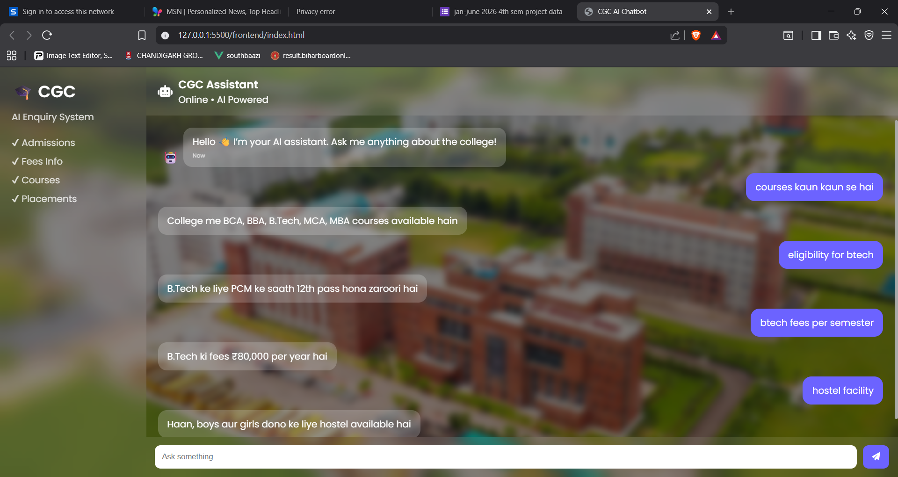
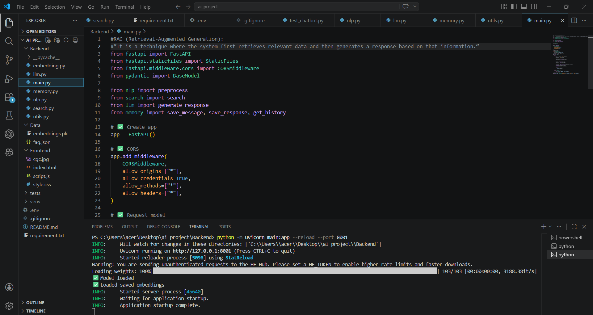

# 🎓 AI College Enquiry Chatbot

An intelligent AI-powered chatbot designed to automate college enquiry systems. It leverages **NLP, embeddings, and Retrieval-Augmented Generation (RAG)** to deliver accurate and context-aware responses for student queries.

---

## 🚀 Live Demo

👉 Run locally:  
http://127.0.0.1:8001/app

---

## 📸 Project Screenshots

### 💬 Chatbot Conversation


---

### ⚙️ Backend API (FastAPI)


---

## 🚀 Features

- 🤖 AI-powered chatbot for student queries
- 🧠 NLP preprocessing for better understanding
- 🔍 Semantic search using embeddings (RAG)
- 💬 Real-time chat interface (Frontend + Backend)
- 🧾 Conversation memory handling
- ⚡ FastAPI-based high-performance backend
- 🎨 Modern responsive UI (Glassmorphism design)
- 📦 Cached embeddings for faster responses

---

## 🧠 Tech Stack

### 🔹 Backend
- Python
- FastAPI
- Sentence Transformers
- Scikit-learn (Cosine Similarity)

### 🔹 Frontend
- HTML
- CSS (Glassmorphism UI)
- JavaScript (Fetch API)

### 🔹 AI Concepts
- Natural Language Processing (NLP)
- Embeddings
- Vector Similarity Search
- Retrieval-Augmented Generation (RAG)

---

## 📂 Project Structure

```
ai_project/
│
├── Backend/
│   ├── main.py
│   ├── nlp.py
│   ├── search.py
│   ├── embedding.py
│   ├── llm.py
│   ├── memory.py
│
├── Frontend/
│   ├── index.html
│   ├── style.css
│   ├── script.js
│   ├── cgc.jpg
│
├── Data/
│   ├── faq.json
│   ├── embeddings.pkl
│
├── Screenshot/
│   ├── chatbot-response-demo.png
│   ├── fastapi-chat-endpoint.png
│
├── tests/
│   ├── test_chatbot.py
│
├── requirements.txt
├── .gitignore
└── README.md
```

---

## ⚙️ Installation & Setup

### 1️⃣ Clone Repository
```bash
git clone https://github.com/karan-sharma-aiml/cgc-ai-enquiry-chatbot.git
cd cgc-ai-enquiry-chatbot

2️⃣ Create Virtual Environment
python -m venv venv
venv\Scripts\activate

3️⃣ Install Dependencies
pip install -r requirements.txt

4️⃣ Run Backend Server
cd Backend
python -m uvicorn main:app --reload --port 8001

5️⃣ Open Application
👉 Open in browser:
http://127.0.0.1:8001/app

🔄 Working Flow
User Input
   ↓
Frontend (HTML/CSS/JS)
   ↓
FastAPI Backend (API)
   ↓
NLP Preprocessing
   ↓
Embedding Generation
   ↓
Vector Search (Cosine Similarity)
   ↓
Response Generation
   ↓
Frontend Display

🧠 Key Concept: RAG
This project implements Retrieval-Augmented Generation (RAG):

2006Retrieves relevant answers using vector similarity
Enhances responses using AI logic
Provides more accurate results than keyword-based systems

🎯 Use Cases
🎓 College enquiry automation
💬 Student support chatbot
🏫 Educational institution websites
📞 AI-based helpdesk systems

🔐 Notes
.env and venv/ are excluded via .gitignore
Embeddings are cached (embeddings.pkl) for performance optimization

🚀 Future Improvements
🌍 Multi-language support (Hindi/Punjabi)
🎙️ Voice-based chatbot
📊 Admin dashboard
🤖 Advanced LLM integration (GPT)
🔄 Working Flow

👨‍💻 Author

Karan Sharma
🔗 GitHub: https://github.com/karan-sharma-aiml

⭐ Support

If you like this project:

⭐ Star this repository
🔁 Share with others
💬 Give feedback

💡 Final Note

This project demonstrates a real-world AI system combining:

NLP
RAG Architecture
Full-stack development

Thankyou

